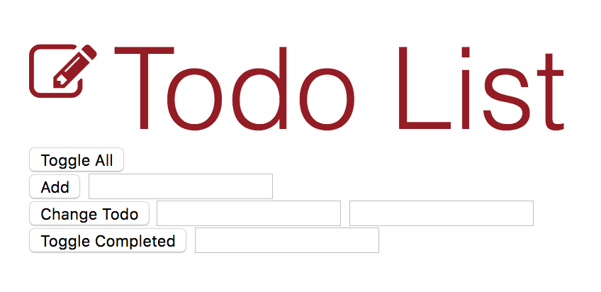

# todoList # watchandcode
(practical javascript gordon watch and code)

Vanilla Javascript: TodoList App
[Demo](http://heggy.me/todoList/todo.html)

V1 Requirements:
- It should have a place to store todos
- It should have a way to display todos
- It should have a way to add new todos
- It should have a way to change a todos
- It should have a way to delete a todos

V2 Requirements:
- It should have a function to display todos
- It should have a function to add todos
- It should have a function to change todos
- It should have a function to delete todos

V3 Requirements:
- It should store the todos array on an object
- It should have a displyTodos method
- It should have an addTodo method
- It should have a changeTodo method
- It should have a deleteTodo method

Overall lesson from V3:
- We moved from stand alone function to stand alone object.  This is great since everything that is related to todoList is on todoList object.  There is an organizational benefit you get from grouping things inside of an object.  
- We learned to create method inside object.  One key note: this inside of method refers to object name.  You may use '.' to reference to the object's property key name.  ex) this.addTodo  (object.propertyKeyName)

V4 Requirements:
- todoList.addTodo should add objects
- todoList.changeTodo should change the todoText property
- todoList.toggleCompleted should change the completed property

Overall lesson from V4: 
- Why object?  Object is a great way to represent more complicated data with properties on it.  
- Using dot notation: 
this.todos[position].todoText = todoText;
- Toggling boolean value T/F by using bang operator (!) (which gives opposite of what comes after it)
- true, !true > false

Lesson on forLoop:
- We may loop through using i. ex: for(var i = 0; i <3; i++) { 
    console.log(testArray[i]) }

V5 Requirements:
- .displayTodos should show .todoText (done)
- .displayTodos should tell you if .todos is empty (todo)**
- .displayTodos sould show .completed

Overall lesson from V5:
- We applied for loop to iterate through Todos array
- First time for displayTodos to become useful by showing .completed ( ) vs (x)

V6 Requirement:
- .toggleAll: If everything's true; make everything false. (make everything unchecked!)
- .togglaAll: Otherwise, make everything true. (make them checked!)

Overall lesson from V6:
- Only time .toggleAll to toggle to false (not done) is when all true 
- Every other times: .toggleAll make it true (done) 
- If feel lost start by writing down as you are talking to someone: pseudo: completedTodos === totalTodos > create these two variable now

V7 Requirements:
- There should be a "Display todos" button and a "Toggle all" button in the app.
- Clicking "Display todos" should run todoList.displayTodos.
- Clicking "Toggle all" should run todoList.toggleAll.

V8 Requirements:
- It should have working controls for .addTodo
- It should have working controls for .changeTodo
- It should have working controls for .deleteTodo
- It should have working controls for .toggleCompleted

V9 Requirements:
- There should be an li element for every todo
- Each li element should contain .todoText
- Each li element should show .completed

Interlude: Function inside of functions
- runWithDebugger
- setTimeOut
- forEach
- addEventListener
- Buzzword: Higher order functions and callback functions

V10 Requirements:
- There should be a way to create delete buttons
- There should be a delete button for each todo
- Each li should have an id that has the todo position
- Delete buttons should have access to the todo id
- Clicking delete should update todoList.todos and the DOM

V11 Requirements:
- todoList.toggleAll should use forEach
- view.displayTodos should use forEach